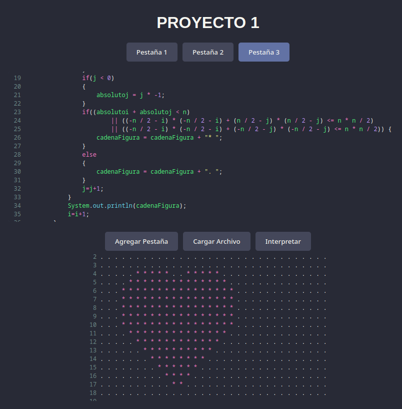
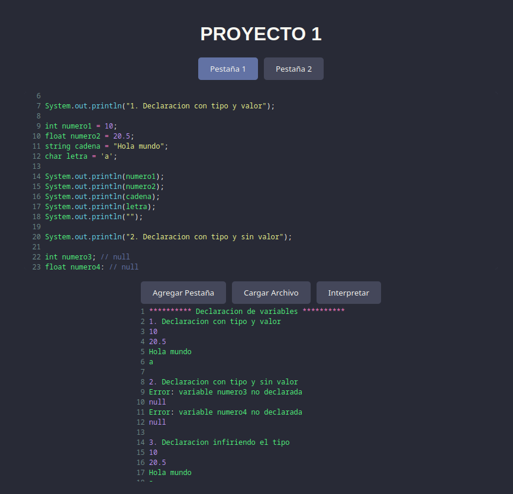
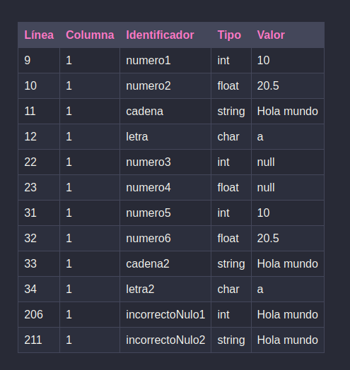

# Guia de uso de OakLand

[Link del Interprete](https://henryd11703.github.io/OLC2_Proyecto1_202004071/)

[Manual Tecnico](/Reportes/ManualTecnico.md)

[Gramatica](/Reportes/gramatica.txt)

### Descripcion General

OakLand es un lenguaje de programación inspirado en la sintaxis de Java. Es un lenguaje multiparadigma que soporta tanto la programación procedimental como la programación funcional. Este manual describe las características clave del lenguaje OakLand, proporcionando detalles sobre la sintaxis, las operaciones soportadas, la estructura, entre otros aspectos.



## Caracteristicas Clave
- **Sintaxis:** OakLand brinda una sintaxis simple de utilizar
- **Tipos Staticos:** Las variables en OakLand tienen un tipo fijo cuando se asignan
- **Arrays y Matrices:** Oakland cuenta con Arrays y Matrices multidimensionales
- **Funciones:** OakLand cuenta con funciones que el usuario puede crear y con funciones nativas del lenguaje

## Estructura del lenguaje
### Tipos de Datos
1. Datos Primitivos
1.1 `int` Para datos numericos enteros
1.2 `float` Para datos numericos decimales
1.3 `string`Para cadenas de texto
1.4 `boolean`Para datos de tipo logico, como `true`o `false`

2. Datos de tipo compuesto
2.1 `array` un vector de datos de cierto tipo
2.2 `matriz`  un vector especifico que puede contener `n` cantidad de vectores dentro 

### Ejemplos: 
```javascript
int num = 10;
float decimal = 5.5;
string text = "Hello, World";
boolean isValid = true;
char letter = 'A';
```
Las variables tambien se pueden declarar sin especificar un tipo, el lenguaje es capaz de reconocer el tipo de la variable que se esta creando

```javascript
var inferredType = 10;
```

3. Estructuras de control

3.1 If else

```javascript
if (condition) {
   // Ejecuta este bloque si la condicion es verdadera
} else {
   // Ejecuta este bloque si la condicion es falsa
}
```

3.2 Switch - Case

```javascript
switch (variable) {
   case value1:
      // si case uno se cumple
      break;
   case value2:
      // si case dos se cumple
      break;
   default:
      // si ninguno se cumple
}

```
3.3 Blucles

```javascript
while (condition) {
    // Repite este bloque siempre que se cumpla la condicion
}

for (int i = 0; i < 10; i+=1) {
   // Repite este bloque siempre que se cumpla la condicion
   // Tener en cuenta que la forma de hacer el incremento es con +=
}
```

4. Arrays y matrices

4.1 Arrays

```javascript
int[] numbers = {1, 2, 3, 4, 5};
int[] numbers = new int[5]; 
```
4.2 Matrices

```javascript
int[][] matrix = new int[3][3];  
matrix[0][0] = 1;

```

5. Funciones
5.1 Declaracion

```javascript
int add(int a, int b) {
   return a + b;
}

```

5.2 Llamada de funciones
```javascript
int result = add(5, 10);
```

6. Funciones embebidas
- `System.out.println()`: Imprime el valor o la lista de valores en consola.
- `parseInt()`: Convierte un string a un int.
- `parseFloat()`: Convierte un string a un float.
- `toString()`: Convierte cualquiera de los otros tipos a string.
- `toLowerCase()`: Convierte un string a minusculas.
- `toUpperCase()`: Convierte un string a mayusculas.
- `typeof()`: Retorna el tipo de una variable.

6.1 Ejemplo de funciones embebidas

```javascript
System.out.println("El valor es: ", 100);
int number = parseInt("123");
string lower = toLowerCase("HOLA"); // hola

```

## Reporte de errores y Tabla de simbolos

- **Reporte de Errores**: Se muestra en la consola y en la seccion de reportes los errores encontrados en la interpretacion
- **Tabla de simbolos**: Se muestra en el area de reportes los simbolos declarados en el codigo

### Imagenes





